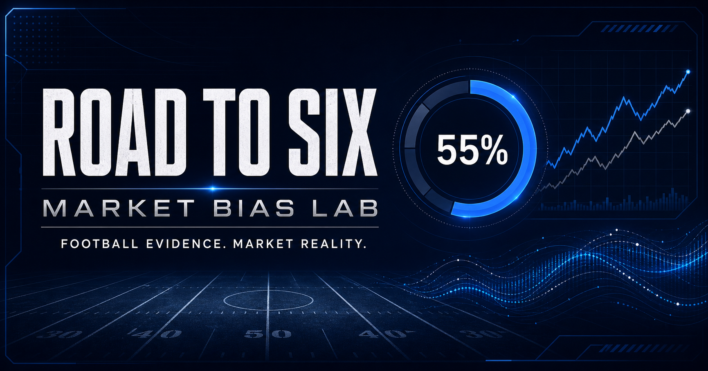

# Road to Six



**Road to Six** is an unofficial Dallas Cowboys forecasting and market-bias lab. It demonstrates how a technical product manager can combine sourced football evidence, betting lines, probability modeling, runtime AI, responsible-use controls, and release governance.

The name reflects the Cowboys' pursuit of a sixth Super Bowl championship after five wins. See the [Dallas Cowboys historical overview](https://www.dallascowboys.com/news/super-powers-what-the-cowboys-can-take-from-the-1992-team) and [Pro Football Hall of Fame team history](https://www.profootballhof.com/teams/dallas-cowboys).

## Product promise

Change the assumptions, compare the football and market signals, and understand the probability and uncertainty.

The MVP now uses a versioned nflverse snapshot for the 2026 Dallas roster and schedule, complete 2025 regular-season player production baselines, market lines where available, a walk-forward probability model, a holdout backtest, and a cost-safe runtime explanation endpoint. An owner-only [hosted release candidate](https://road-to-six-erl.erlrickylre.chatgpt.site) is deployed. Public hosting has not been approved.

## Portfolio proof

- Product brief with problem, users, outcomes, scope, and measurement plan
- Real player and game evidence with source and freshness labels
- Weekly opponent production leaders joined from the selected game's active 2026 roster and complete 2025 stats
- Interactive football-only and market-aware probability forecasts
- Scenario controls for Dak Prescott, CeeDee Lamb, George Pickens, Javonte Williams, the defensive core, and the selected opponent's top producer
- Moneyline, spread, total, line-status, and market-implied probability comparison
- Walk-forward model evaluation on a 2024 to 2025 holdout
- Runtime AI function calling with structured evidence, uncertainty, a $9.50 application cutoff, and deterministic fallback
- Release gate covering data, quality, accessibility, and trademark risk
- Codex operating instructions, a reusable review skill, tests, and CI
- Editable [Figma user flow](https://www.figma.com/board/m4Jj2PH2pCWMjcyUFNibyS?utm_source=other&utm_content=edit_in_figjam&oai_id=v1%2FxUmyGVk5KOQTJRulUQKNwQe3yEmxEnoOxDP8Doq1z3TYSWL0h07UaA&request_id=ee641610-369e-4632-a92c-ff043a56fac1)

## Quick start

Requirements: Node.js 22.19.0 or newer.

```bash
npm install
npm run dev
```

The finished preview remains fully usable without external credentials. Add the free market-data and runtime AI keys through local or hosted secret configuration to validate those live integrations. Never commit credentials. Runtime AI defaults to GPT-5.6 Luna and the application stops calls at the $9.50 monthly safety cutoff.

```bash
cp .env.example .env.local
```

Validation:

```bash
npm run lint
npm test
```

Rebuild the attributed data snapshot after downloading the current nflverse source files:

```bash
npm run data:snapshot
```

The player snapshot uses nflverse's `stats_player_reg_2025.csv` release asset. Raw source files remain outside the repository.

## Documentation

- [Product brief](docs/product-brief.md)
- [Architecture](docs/architecture.md)
- [MVP backlog](docs/mvp-backlog.md)
- [Measurement plan](docs/measurement-plan.md)
- [Data and licensing spike](docs/data-licensing-spike.md)
- [Release review](docs/release-review.md)
- [Public use review](docs/public-use-review.md)
- [Figma flow](docs/figma-flow.md)
- [Decision log](docs/decision-log.md)

## Product boundaries

- No player medical, contract, private, or nonpublic data
- No official Dallas Cowboys or NFL marks
- No player likenesses or official uniforms
- No unlicensed feed is enabled for public display
- No paid sports-data feeds, bettor splits, or paid historical odds in the MVP
- No personalized betting advice, picks, stake sizes, payout claims, affiliate links, or wager placement
- No affiliation with or endorsement by the Dallas Cowboys, the NFL, or their partners

## Technology

Next.js compatible React, TypeScript, vinext, Cloudflare Workers compatible output, D1 budget ledger, OpenAI Responses API integration, Node test runner, ESLint, and GitHub Actions.

## Rights notice

Original code and documentation are available under the [MIT License](LICENSE). Third party data and rights are governed by the [Third Party Data and Rights Notice](NOTICE.md).

This project is a portfolio prototype. Dallas Cowboys, NFL, Super Bowl, player names, and related marks belong to their respective owners. References identify the subject of the project and do not imply affiliation or endorsement.
