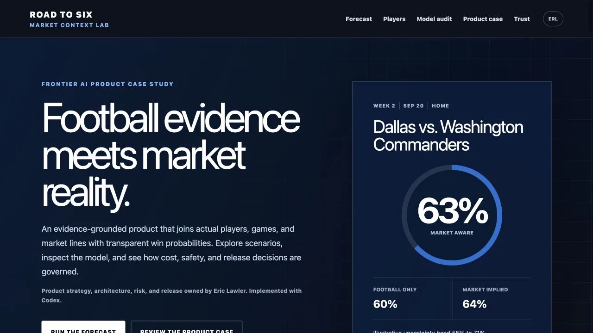
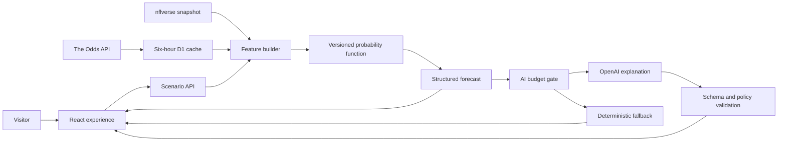

# Road to Six

[](https://github.com/erlawler/road-to-six/actions/workflows/ci.yml)
[](docs/ai-evaluation.md)
[](RELEASE_NOTES.md)
[](LICENSE)




**Road to Six is a technical product management case study in evidence-grounded AI.** It turns Dallas Cowboys football data and betting-market context into an inspectable probability workflow without giving betting advice.

The product demonstrates how I frame an ambiguous problem, choose the right boundary between deterministic software and frontier AI, integrate governed data sources, define measurable quality gates, and move a product from concept to a private release candidate.

> **Current status:** Version 1.0.0 passes the build, lint, 73-test, 12-case AI-evaluation, dependency-audit, and four-scenario live-scorecard gates. The owner-only preview is deployed and passed an authenticated hosted smoke test for hydration, matchup changes, selected-game market freshness, live odds, deterministic forecast, Runtime AI, reliability receipt, reset behavior, and browser errors. GitHub push, release creation, and public hosting remain blocked until my approval.

## Recruiter snapshot

| Area | Summary |
|---|---|
| My role | Technical product manager, product decision owner, and release approver |
| Delivery model | I directed Codex as an implementation and review partner while retaining product, architecture, risk, and acceptance decisions |
| Target user | Hiring managers and technical product leaders evaluating product judgment, plus football fans exploring forecast assumptions |
| Core job | Inspect football and market evidence, change assumptions, and understand a traceable probability and its uncertainty |
| Product scope | Real roster, schedule, player, game, and current market data; scenario modeling; model audit; runtime AI explanation |
| Key constraint | $0 sports-data vendor spend and no more than $10 monthly runtime AI spend |
| Current release | v1.0.0 owner-only preview with validated live integrations, hosted smoke evidence, and documented public-launch gates |

**Ownership:** I owned the product strategy, technical decisions, risk acceptance, and release approval. Codex accelerated implementation, testing, review, and documentation within the boundaries I defined.

## Two-minute reviewer path

1. **First 30 seconds:** Read [The problem](#the-problem) and [What I owned](#what-i-owned).
2. **Next 30 seconds:** Scan the [key product decisions](#key-product-decisions-and-tradeoffs).
3. **Next 30 seconds:** Review the [verified outcomes](#verified-outcomes), including the honest model conclusion.
4. **Final 30 seconds:** Inspect the [architecture](#architecture), [frontier AI judgment](#frontier-ai-product-judgment), and [artifact set](#portfolio-artifacts).

For the complete narrative, open the [portfolio case study](docs/portfolio-case-study.md).

## The problem

Sports forecasts often present a confident number without showing the evidence, assumptions, uncertainty, market context, or model limitations. That creates a product trust problem, not only a modeling problem.

Road to Six makes the decision path visible:

1. Select a Dallas matchup.
2. Inspect sourced team, player, opponent, and market evidence.
3. Change named scenario assumptions.
4. Compare football-only, market-implied, and market-aware probabilities.
5. Review the forecast drivers, uncertainty, source freshness, and model version.
6. Request a grounded AI explanation that cannot change the calculated probability.

## What I owned

1. **Product strategy:** Defined the user, job to be done, product principles, scope, non-goals, success measures, and release decision.
2. **Prioritization:** Used BETS to advance the concept, then documented major tradeoffs through architecture decision records.
3. **Data product design:** Selected attributed nflverse data and free-tier odds, defined normalization and freshness requirements, and rejected paid bettor-split data.
4. **Forecast governance:** Chose a transparent walk-forward Elo baseline and a predeclared market blend before considering a more complex model.
5. **Frontier AI design:** Assigned probability calculation to a versioned deterministic function and AI to structured explanation, evidence, and uncertainty.
6. **Platform controls:** Defined server-side secrets, an atomic odds-refresh lease, request limits, an approved-model allowlist, schema validation, a six-hour odds cache, a $9.50 AI cutoff, and deterministic fallback.
7. **Release management:** Made accessibility, security, privacy, data rights, responsible use, and trademark review explicit launch gates.

## Key product decisions and tradeoffs

| Decision | Product rationale | Tradeoff accepted |
|---|---|---|
| Use deterministic code for probability | The result stays testable, reproducible, and versioned | The system is less flexible than asking an LLM to reason freely |
| Use AI for explanation only | AI adds accessible synthesis without becoming the source of truth | Explanations must pass schema and semantic validation |
| Blend 20% football Elo with 80% market probability | Establishes a transparent, predeclared baseline | The baseline does not claim to beat the market |
| Keep exploration anonymous | Reduces friction, privacy risk, and security scope | No saved scenarios or personalization |
| Use free data sources and a six-hour odds cache | Keeps operating cost predictable | Data breadth and refresh frequency are intentionally limited |
| Exclude bettor splits | Avoids unsupported claims about Cowboys popularity | Popularity-driven market bias remains an unvalidated hypothesis |
| Prohibit betting recommendations | Keeps the experience educational and responsible | The product provides analysis, not action |

## Verified outcomes

These are implemented or validated outcomes, not portfolio targets.

| Outcome | Verified evidence |
|---|---|
| Sourced football experience | Versioned 2026 roster and schedule snapshot with complete 2025 regular-season player baselines and weekly opponent leaders |
| Transparent model evaluation | 2024 to 2025 walk-forward holdout: football-only Brier 0.220, market-aware Brier 0.207, market baseline Brier 0.206 |
| Honest model conclusion | The market-aware baseline improved on football-only Elo but did not outperform the market baseline |
| Live market integration | Eleven current Cowboys games matched the schedule in the authenticated hosted review, with source, retrieval time, cache state, and selected-game applicability preserved |
| Free-tier cost design | Successful six-hour cache persistence models 372 credits in a 31-day month, below the 500-credit allowance; failures remain monitored |
| AI reliability controls | Offline evaluation passed 12 of 12 expected outcomes across seven criteria and 84 binary checks |
| Live AI contract | One AI-mode response preserved the deterministic probability and passed all seven live checks |
| Live AI scorecard | Four of four Runtime AI cases passed with 3,568 ms average latency and $0.013118 total estimated cost; four of four deterministic cases passed at $0 |
| AI operations | A reliability receipt exposes version, latency, token, cost, validation, source, and fallback evidence |
| Product quality | Production build, lint, 73 automated tests, 12-case AI evaluation, and dependency audit passed |
| Dependency security | Current audit returned zero vulnerabilities |
| Release governance | Accessibility, security, privacy, responsible-use, data-rights, and trademark reviews are documented |

See the [release review](docs/release-review.md) for the full evidence and the remaining regression and public-hosting gates.

## Architecture


```mermaid
flowchart LR
    visitor[Visitor] --> ui[React experience]
    ui --> api[Scenario API]
    football[nflverse snapshot] --> features[Feature builder]
    odds[The Odds API] --> cache[Six-hour D1 cache]
    cache --> features
    api --> features
    features --> model[Versioned probability function]
    model --> result[Structured forecast]
    result --> ui
    result --> budget[AI budget gate]
    budget --> ai[OpenAI explanation]
    budget --> fallback[Deterministic fallback]
    ai --> validate[Schema and policy validation]
    validate --> ui
    fallback --> ui
```

The architecture keeps credentials and vendor calls server-side. It also keeps the calculation path available when market data, AI, or budget capacity is unavailable.

## Frontier AI product judgment

This project is intentionally not an LLM wrapper.

- **AI explains:** It translates model drivers, source evidence, and uncertainty into a structured narrative.
- **AI does not calculate:** The versioned probability function owns the number.
- **AI is grounded:** The server supplies a bounded scenario, model result, and cited evidence.
- **AI is evaluated:** The response must preserve probability, model version, source time, required evidence, and uncertainty.
- **AI is constrained:** The server owns the summary and disclaimer, then exposes only exact validated evidence fields from the model.
- **AI is observable:** Each run returns a reliability receipt with version, latency, token, cost, source, validation, and fallback evidence.
- **AI can fail safely:** A deterministic explanation preserves the core user job when quota, timeout, budget, or validation blocks AI.
- **AI cost is governed:** A D1 ledger reserves and reconciles estimated use, stops application calls at $9.50, and preserves a margin under the $10 project limit.
- **AI traffic is bounded:** One atomic shared request check runs before market reads or fallback work, without adding identity or profile data.

I also used Codex as a delivery system, not as an ungoverned author. Repository instructions, scoped tasks, automated checks, specialist reviews, and explicit publication approval kept the work auditable.

## Portfolio artifacts

| Artifact | What it demonstrates |
|---|---|
| [Detailed portfolio case study](docs/portfolio-case-study.md) | Product narrative, ownership, tradeoffs, evidence, and lessons |
| [Product brief](docs/product-brief.md) | Problem framing, users, scope, success measures, and launch decision |
| [Architecture](docs/architecture.md) | Components, trust boundaries, data flow, and AI controls |
| [Frontier AI architecture](docs/frontier-ai-architecture.md) | Deterministic and AI responsibilities, trust boundaries, runtime flow, and failure behavior |
| [Runtime AI evaluation](docs/ai-evaluation.md) | Binary product criteria, positive cases, adversarial cases, and release gate |
| [Live AI scorecard](docs/live-ai-scorecard.md) | Actual-response quality, latency, cost comparison, and bounded interpretation |
| [Demo media](docs/demo-media.md) | Hosted screenshots, animated walkthrough, captions, and privacy review |
| [Usability research](docs/usability-research.md) | Owner feedback, five proxy pretests, accepted changes, and the remaining human-session gate |
| [Codex collaboration](docs/codex-collaboration.md) | Eric's ownership, Codex acceleration, governance, and human approval points |
| [Decision log](docs/decision-log.md) | Seventeen product and architecture decisions with rationale |
| [MVP backlog](docs/mvp-backlog.md) | Prioritization, sequencing, acceptance criteria, and delivery status |
| [Measurement plan](docs/measurement-plan.md) | Vision, adoption, integrity, model, and platform measures |
| [Data and licensing spike](docs/data-licensing-spike.md) | Source selection, cost model, rights review, and exit criteria |
| [Release review](docs/release-review.md) | Quality gates, validation evidence, blockers, and approval boundary |
| [Public-use review](docs/public-use-review.md) | Responsible use, privacy, data rights, trademark, and accepted limitations |
| [Editable Figma user flow](https://www.figma.com/board/m4Jj2PH2pCWMjcyUFNibyS?utm_source=other&utm_content=edit_in_figjam&oai_id=v1%2FxUmyGVk5KOQTJRulUQKNwQe3yEmxEnoOxDP8Doq1z3TYSWL0h07UaA&request_id=ee641610-369e-4632-a92c-ff043a56fac1) | End-to-end experience and product evolution |
| [Static repository flow](docs/figma-flow.md) | Reviewable Mermaid representation when external Figma access is unavailable |
| [Usability research](docs/usability-research.md) | Privacy-safe test plan, findings template, and feedback-to-outcome traceability |
| [Repository launch checklist](docs/repository-launch-checklist.md) | GitHub presentation, security, media, research, release, hosting, and rollback gates |
| [LinkedIn launch kit](docs/linkedin-launch-kit.md) | Launch post, project summary, demo script, and publication checklist |
| [v1.0.0 release notes](RELEASE_NOTES.md) | User-facing capabilities, improvements, evidence, and limitations |
| [Changelog](CHANGELOG.md) | Versioned product and repository changes |

## Run locally

Requirements: Node.js 22.19.0 or newer.

```bash
npm install
cp .env.example .env.local
npm run dev
```

The application remains usable without external credentials through bundled data and deterministic fallback. Never commit credentials.

Run the quality gates:

```bash
npm run lint
npm run eval
npm test
npm audit --audit-level=high
```

Run the bounded four-scenario live scorecard only with the local server, valid server-side credentials, and available AI budget:

```bash
LIVE_EVAL_BASE_URL=http://localhost:3000 \
LIVE_EVAL_OUTPUT=/tmp/road-to-six-live-ai-scorecard.json \
npm run eval:live
```

Rebuild the attributed football snapshot after downloading current nflverse source files:

```bash
npm run data:snapshot
```

The snapshot builder uses nflverse release assets. Raw source files remain outside the repository.

## Technology

Next.js compatible React, TypeScript, vinext, Cloudflare Workers compatible output, D1 caching and budget ledger, OpenAI Responses API, Node test runner, ESLint, and GitHub Actions.

## Product boundaries

- No player medical, contract, private, or nonpublic data
- No official Dallas Cowboys or NFL logos, player likenesses, or uniform artwork
- No paid sports-data feeds, bettor splits, or paid historical odds
- No personalized betting advice, picks, stake sizes, payout claims, affiliate links, sportsbook links, or wager placement
- No affiliation with or endorsement by the Dallas Cowboys, the NFL, or their partners

Original code and documentation are available under the [MIT License](LICENSE). Third-party data and rights are governed by the [Third Party Data and Rights Notice](NOTICE.md).
