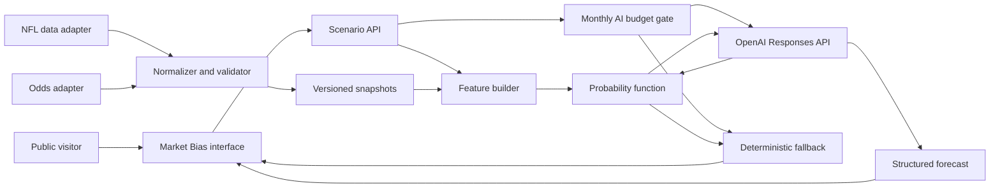

# Architecture

## Answer

The implemented local MVP is a public-ready, anonymous Market Bias Lab with server-side data adapters, a versioned nflverse snapshot, a testable probability function, a D1 monthly budget ledger, and a runtime AI explanation endpoint. Live vendor calls remain disabled until credentials are configured.

## Target components

| Component | Responsibility | Product reason |
|---|---|---|
| Data adapters | Fetch football data and free-tier odds | Isolates vendor changes and keeps credentials server-side. |
| Normalizer and validator | Join games, teams, and players; stamp freshness and license metadata | Prevents silent source mismatches. |
| Versioned snapshots | Preserve the exact evidence used for a forecast | Makes results reproducible and auditable. |
| Feature builder | Produce documented football-only and market-aware model inputs | Separates raw data from modeling choices. |
| Probability function | Return probability, confidence band, and model metadata | Provides a testable forecast rather than an LLM guess. |
| Monthly AI budget gate | Stop application AI at $9.50 against a $10 project maximum | Keeps the personal operating cost predictable and preserves a safety margin. |
| Runtime AI endpoint | Call the probability function and explain drivers, evidence, and uncertainty | Demonstrates function calling and grounded product AI. |
| Deterministic fallback | Return the probability and templated explanation if AI is unavailable | Protects reliability and cost limits. |
| Public React interface | Explore games, players, lines, spreads, scenarios, and forecast results | Keeps the portfolio immediately accessible without sign-in. |
| CI and evaluation suite | Test joins, probability bounds, model calibration, schema fidelity, and content policy | Makes quality and governance observable. |

## Data flow

1. The snapshot builder reads approved football and market records, normalizes identifiers, and writes a versioned local artifact.
2. The free odds adapter can refresh current markets on demand after its server-side key is configured.
3. The visitor selects a game, reviews the opponent's four highest 2025 PPR producers who remain on its active 2026 roster, and changes Cowboys or opponent scenario assumptions without signing in.
4. The feature builder calculates football-only probability and blends it with vig-adjusted moneyline probability. Spread, total, and line status remain visible market context without being double counted.
5. The runtime AI calls the versioned probability function as a required tool.
6. The function returns the calculated probability, confidence band, and model version.
7. The AI returns structured drivers, evidence references, and uncertainty while preserving the function result.
8. The server validates the response. If validation or the AI call fails, it returns the probability with a deterministic explanation.

## Trust boundaries

- Vendor and OpenAI API keys remain server-side in environment variables.
- No account, profile, or wagering-history data is collected.
- No browser data is persisted.
- OpenAI receives a bounded scenario payload and cited evidence, not raw vendor responses or personal data.
- The generated social card contains no official team mark or player likeness.
- Headshots, logos, and official uniform artwork are excluded.
- A feed cannot be enabled publicly until its display rights are documented.
- Every forecast displays source timestamps, model version, and educational-use language.

## Forecast and AI controls

- Produce both football-only and market-aware probabilities.
- Convert consensus moneyline to a vig-adjusted implied probability for comparison.
- Use vig-adjusted moneyline as the market probability input. Show spread, total, and line status as separate evidence.
- Bound probability from 0 to 1 and reject malformed or unsupported outputs.
- Require structured output with probability, confidence, drivers, evidence, uncertainty, and notice.
- Set `store: false` for OpenAI Responses API calls.
- Default to GPT-5.6 Luna and reserve cost before each request using model-specific standard token rates.
- Reconcile actual input and output tokens in D1 after each successful response.
- Use a dedicated OpenAI project with a $10 monthly maximum and stop application calls at $9.50.
- Bound prompt size and output tokens. Add request caching before a public launch if traffic requires it.
- Prohibit recommended bets, stake sizes, payout claims, and sportsbook links.

## Codex operating model

The repository uses:

- `AGENTS.md` for durable product, engineering, and public content rules
- A repo skill for repeatable release review
- Source-controlled product artifacts and decision records
- Tests for scoring and rendered content
- A manual, read-only Codex review workflow for pull requests

## Implementation boundary

Authentication and saved scenarios remain out of scope. The only persistent record is an aggregate monthly AI-cost ledger with no identity data. Sports data must remain within free source allowances, and bettor splits remain deferred. See [Data and Licensing Spike](data-licensing-spike.md).
