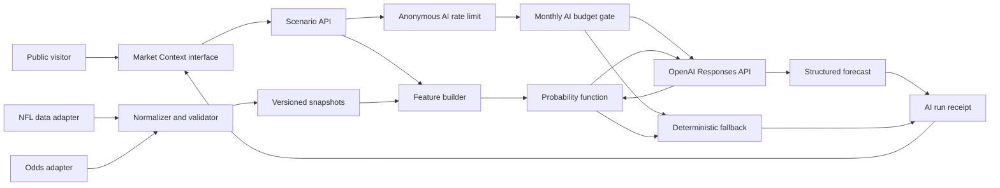

# Architecture

## Answer

The v1.0.0 release is an anonymous Market Context Lab with server-side data adapters, a versioned nflverse snapshot, a six-hour D1 odds cache, a testable probability function, an anonymous AI request limit, a D1 monthly budget ledger, a Runtime AI explanation endpoint, and an inspectable reliability receipt. The GitHub release and Sites version 13 are public, and the product has no account or identity layer. Live odds, a four-scenario Runtime AI scorecard, CI, CodeQL, the authenticated hosted review, and the signed-out production smoke test pass.

Showcase evidence:

- [Frontier AI architecture](frontier-ai-architecture.md)
- [Runtime AI evaluation](ai-evaluation.md)
- [Codex collaboration and product ownership](codex-collaboration.md)

```mermaid
flowchart LR
    visitor[Public visitor]
    ui[Market Context interface]
    football[NFL data adapter]
    odds[Odds adapter]
    ingest[Normalizer and validator]
    snapshots[Versioned snapshots]
    scenario[Scenario API]
    features[Feature builder]
    probability[Probability function]
    limit[Anonymous AI rate limit]
    budget[Monthly AI budget gate]
    ai[OpenAI Responses API]
    receipt[AI run receipt]
    result[Structured forecast]
    fallback[Deterministic fallback]

    visitor --> ui
    football --> ingest
    odds --> ingest
    ingest --> snapshots
    ui --> scenario
    scenario --> features
    snapshots --> features
    features --> probability
    scenario --> limit
    limit --> budget
    budget --> ai
    budget --> fallback
    ai --> probability
    probability --> ai
    ai --> result
    result --> receipt
    probability --> fallback
    receipt --> ui
    fallback --> receipt
```

## Target components

| Component | Responsibility | Product reason |
|---|---|---|
| Data adapters | Fetch football data and free-tier odds | Isolates vendor changes and keeps credentials server-side. |
| Normalizer and validator | Join games, teams, and players; stamp freshness and license metadata | Prevents silent source mismatches. |
| Versioned snapshots | Preserve the exact evidence used for a forecast | Makes results reproducible and auditable. |
| Feature builder | Produce documented football-only and market-aware model inputs | Separates raw data from modeling choices. |
| Probability function | Return probability, confidence band, and model metadata | Provides a testable forecast rather than an LLM guess. |
| Odds refresh control | Coordinate edge-worker refreshes through an atomic D1 lease and cooldown | Prevents concurrent isolates from multiplying vendor usage. |
| Monthly AI budget gate | Stop application AI at $9.50 against a $10 project maximum | Keeps the personal operating cost predictable and preserves a safety margin. |
| Anonymous AI rate limit | Limit the shared public AI path to 20 requests per aligned five-minute bucket through one atomic D1 statement | Protects the budget without collecting identity, avoids request-path schema work, and denies excess traffic before market reads. |
| Runtime AI endpoint | Call the probability function and explain drivers, evidence, and uncertainty | Demonstrates function calling and grounded product AI. |
| AI run ledger and reliability receipt | Record bounded operational metadata and show model, prompt, contract, evaluation, latency, tokens, cost, source, validation, and fallback state | Makes AI operations and failure evidence inspectable without exposing prompts or personal data. |
| Deterministic fallback | Return the probability and templated explanation if AI is unavailable | Protects reliability and cost limits. |
| Public React interface | Explore games, players, lines, spreads, scenarios, and forecast results | Keeps the showcase immediately accessible without sign-in. |
| CI and evaluation suite | Test joins, probability bounds, model calibration, schema fidelity, and content policy | Makes quality and governance observable. |

## Data flow

1. The snapshot builder reads approved football and market records, normalizes identifiers, and writes a versioned local artifact.
2. The free odds adapter acquires an atomic D1 refresh lease, then refreshes current markets through a six-hour shared cache.
3. The visitor selects a game, reviews the opponent's four highest 2025 PPR producers who remain on its active 2026 roster, and changes Cowboys or opponent scenario assumptions without signing in.
4. The feature builder calculates football-only probability and blends it with the median of each sportsbook's independently vig-adjusted Dallas probability. Median moneylines, spread, total, and line status remain visible market context without being double counted.
5. The server enforces the anonymous request window, payload limits, and monthly AI budget before making a provider call.
6. The Runtime AI calls the versioned probability function as a required tool.
7. The function returns the calculated probability, confidence band, and model version.
8. The AI returns structured drivers, evidence references, and uncertainty while preserving the function result.
9. The server replaces the model summary and disclaimer with canonical product copy, exposes only validated fields, and records bounded operational evidence after a budget reservation.
10. If validation or the AI call fails, the server returns the probability with a deterministic explanation and a reason code.

## Trust boundaries

- Vendor and OpenAI API keys remain server-side in environment variables.
- No account, profile, or wagering-history data is collected.
- No browser data is persisted.
- OpenAI receives a bounded scenario payload and cited evidence, not raw vendor responses or personal data.
- The aggregate budget, request-window, and AI-run records contain no account, profile, wagering, prompt, or raw vendor data.
- The generated social card contains no official team mark or player likeness.
- Headshots, logos, and official uniform artwork are excluded.
- A feed cannot be enabled publicly until its display rights are documented.
- Every forecast displays source timestamps, model version, and educational-use language.

## Modern LLM provider boundary

The deployed Runtime AI path uses the OpenAI Responses API. Anthropic is not connected in v1.0.0. The architecture demonstrates provider-adaptable product controls, including a deterministic calculation authority, bounded context, tool and output contracts, semantic validation, observability, rate and cost controls, and deterministic fallback. An Anthropic implementation would require a separate adapter, approved-model allowlist, pricing rules, contract tests, and live provider evaluation before release.

## Forecast and AI controls

- Produce both football-only and market-aware probabilities.
- Convert consensus moneyline to a vig-adjusted implied probability for comparison.
- Use vig-adjusted moneyline as the market probability input. Show spread, total, and line status as separate evidence.
- Bound probability from 0 to 1 and reject malformed or unsupported outputs.
- Require structured output with probability, model version, source timestamp, drivers, evidence, uncertainty, and notice.
- Reject AI output that changes the forecast contract or contains actionable betting guidance.
- Set `store: false` for OpenAI Responses API calls.
- Default to GPT-5.6 Luna, allow only the four explicitly priced GPT-5.6 configurations, and reserve cost before each request using model-specific standard token rates.
- Reconcile actual input and output tokens in D1 after each successful response.
- Use a dedicated OpenAI project with a $10 monthly maximum and stop application calls at $9.50.
- Bound streamed request bytes, prompt size, and output tokens.
- Limit the anonymous AI endpoint to 20 requests per shared aligned five-minute bucket and return `429` with `Retry-After` when the limit is reached.
- Cache current odds for six hours in D1, coordinate concurrent edge workers with an atomic D1 lease, and disable repeated client requests while a refresh is active.
- Prohibit recommended bets, stake sizes, payout claims, and sportsbook links.

## Codex operating model

The repository uses:

- `AGENTS.md` for durable product, engineering, and public content rules
- A repo skill for repeatable release review
- Source-controlled product artifacts and decision records
- Tests for scoring and rendered content
- A manual, read-only Codex review workflow for pull requests

## Implementation boundary

Authentication and saved scenarios remain out of scope. Persistence is limited to normalized odds cache data, refresh controls, aggregate AI cost, anonymous request buckets, and bounded AI run metadata. None contains user identity, wagering history, prompts, or raw provider responses. Sports data must remain within free source allowances, and bettor splits remain deferred. See [Data and Licensing Spike](data-licensing-spike.md).
