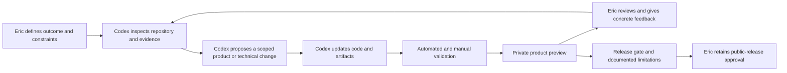
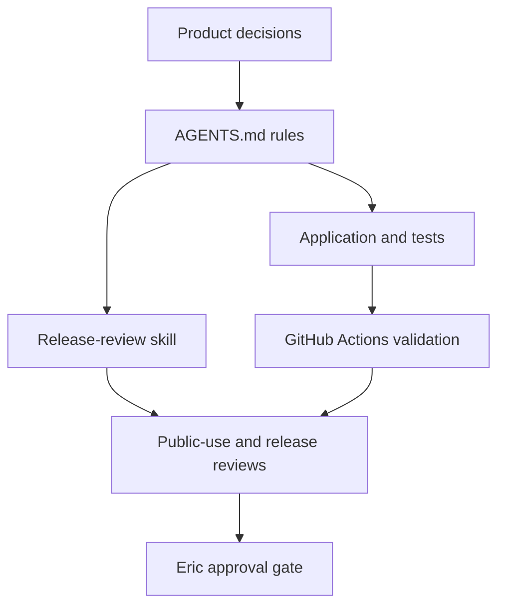

# Codex Collaboration and Product Ownership

## Recruiter answer

Road to Six is Eric Lawler's technical product management case study, built with Codex as an implementation and review accelerator. Eric retained ownership of the problem, product boundaries, tradeoffs, cost envelope, risk acceptance, and release approval. Codex helped translate those decisions into working software, tests, documentation, and a reviewable private release candidate.

The honest claim is not that Eric manually authored every line. The stronger claim is that he directed an AI-assisted product delivery system with explicit requirements, governance, validation, and human approval gates.

## Ownership model

| Area | Eric Lawler owned | Codex accelerated |
|---|---|---|
| Product direction | Selected the Cowboys championship theme and the technical product management portfolio goal. | Converted the direction into a product brief, user flow, architecture, backlog, and repository scaffold. |
| Scope | Approved real football data, current market lines, scenario forecasting, and runtime AI explanation. | Implemented the data adapters, forecast path, interface, and documentation. |
| Boundaries | Set a $0 sports-data target, excluded bettor splits, kept exploration anonymous, and prohibited betting advice. | Encoded those boundaries in application rules, tests, release checks, and public documentation. |
| AI strategy | Chose grounded explanation, visible evidence, uncertainty, and a $10 monthly maximum with a $9.50 application cutoff. | Implemented tool calling, structured output, budget reservation, validation, and deterministic fallback. |
| Experience | Reviewed private previews and requested specific content, scenario, opponent, and interface changes. | Applied scoped revisions and returned an updated preview for review. |
| Risk acceptance | Accepted documented data-rights and trademark limitations while withholding public-hosting approval. | Performed accessibility, security, responsible-use, data-rights, and release reviews with explicit limitations. |
| Release | Retains the final decision to make hosting public. | Prepared the repository, CI, private deployment, and production smoke-test plan. |

## Collaboration loop

This loop turns conversation into durable evidence. Product decisions live in the repository rather than only in chat, and each important change is expected to survive build, test, content, and release review.

## What Codex accelerated

1. **Artifact creation:** Codex translated the product direction into the brief, architecture, Figma flow, backlog, measurement plan, decision log, public-use review, and release review.
2. **Cross-functional implementation:** Codex connected the interface, deterministic forecast, server-side odds integration, D1 persistence, OpenAI integration, and hosted release candidate.
3. **Quality coverage:** Codex created and ran tests for forecast behavior, cost estimates, odds caching, deterministic fallback, and rendered content.
4. **Review breadth:** Codex supported accessibility, responsive-design, security, data-rights, trademark, responsible-use, and dependency reviews.
5. **Iteration speed:** Eric could review a working preview, annotate the experience, and convert feedback into a coordinated change across product, code, tests, and release artifacts.
6. **Operational discipline:** Repository instructions, CI, a reusable release-review skill, and a constrained manual Codex review workflow make the working method repeatable.

These are delivery accelerators. They are not substitutes for product ownership, source verification, user research, legal advice, or release accountability.

## Governance as code

The collaboration is governed by source-controlled controls:

1. [`AGENTS.md`](../AGENTS.md) defines data, AI, cost, responsible-use, accessibility, authentication, credential, and release boundaries.
2. [`decision-log.md`](decision-log.md) records what was decided, what was superseded, and why.
3. [`road-to-six-release-review`](../.agents/skills/road-to-six-release-review/SKILL.md) defines a repeatable review sequence for evidence, scoring, accessibility, public content, tests, and prohibited punctuation.
4. [`ci.yml`](../.github/workflows/ci.yml) runs dependency audit, lint, build, and tests for pull requests and the main branch.
5. [`codex-review.yml`](../.github/workflows/codex-review.yml) provides a manually triggered, read-only Codex review with minimal repository permissions.
6. [`release-review.md`](release-review.md) distinguishes completed gates, accepted limitations, open blockers, owners, and approval requirements.

## Human review points

Eric's review is required where judgment cannot be delegated safely:

- Changing the product objective or data scope
- Adding paid data, bettor splits, authentication, or personal-data persistence
- Changing the $10 provider maximum or $9.50 application cutoff
- Accepting data-rights, trademark, or responsible-use limitations
- Supplying or rotating credentials
- Making the hosted product public

Codex can prepare evidence and recommend a path, but it does not silently expand these boundaries.

## Honest limitations

- This is a portfolio prototype, not evidence of customer adoption, revenue, production scale, or a profitable betting strategy.
- The measurement plan contains targets, not observed public-user outcomes. Product analytics are not implemented.
- Codex-generated work can be incomplete or wrong. Repository rules, tests, source checks, previews, and human review reduce risk but do not remove it.
- The release reviews are product-risk reviews, not legal or accessibility certifications.
- The hosted runtime AI path remains blocked by provider quota in the current release review. The deterministic fallback is the validated behavior.
- The source repository demonstrates direction, implementation, and governance, but it does not imply that Eric independently performed every specialist task.

## How to present the work

A concise and accurate portfolio statement is:

> I led the product definition and AI governance for Road to Six, an evidence-grounded football forecasting prototype. I used Codex to accelerate implementation, testing, documentation, and release review. Deterministic code owns the probability, runtime AI is constrained to tool-grounded explanation, and the product remains usable when AI or live data is unavailable.

Useful interview questions this project can answer:

1. Why was runtime AI included in the explanation layer but excluded from the probability calculation?
2. How were data cost, AI cost, provider failure, and public-use risk converted into product requirements?
3. What evidence supports the market-aware baseline, and what claim does the backtest not support?
4. Why were authentication, bettor splits, and paid historical odds deferred?
5. How did source-controlled agent instructions improve reviewability and reduce scope drift?
6. Which decisions still require a human owner before public release?

## Supporting artifacts

- [`product-brief.md`](product-brief.md) for the problem, users, principles, scope, success measures, and risks
- [`frontier-ai-architecture.md`](frontier-ai-architecture.md) for the AI, trust, cost, and reliability design
- [`measurement-plan.md`](measurement-plan.md) for target metrics and analytics boundaries
- [`decision-log.md`](decision-log.md) for product and technical tradeoffs
- [`public-use-review.md`](public-use-review.md) for accepted data, privacy, trademark, and responsible-use limitations
- [`release-review.md`](release-review.md) for the current release evidence, blockers, and owners
