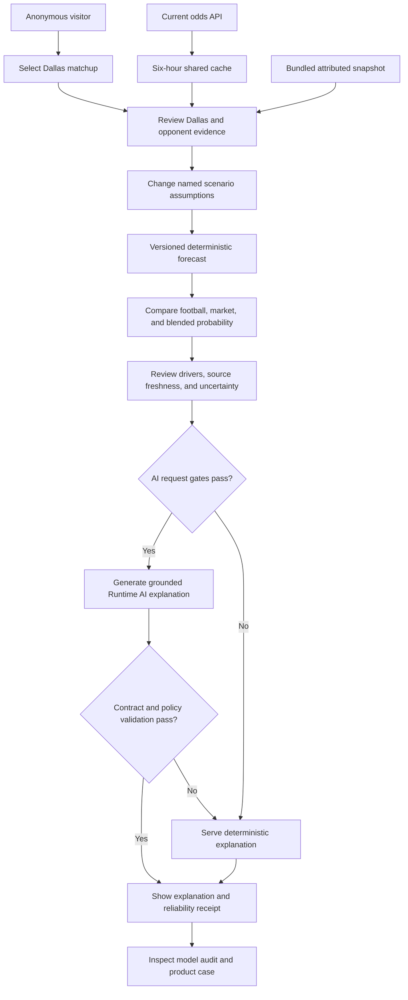

# Figma Flow

The editable FigJam user flow is available here:

[Open the Road to Six MVP User Flow](https://www.figma.com/board/m4Jj2PH2pCWMjcyUFNibyS?utm_source=other&utm_content=edit_in_figjam&oai_id=v1%2FxUmyGVk5KOQTJRulUQKNwQe3yEmxEnoOxDP8Doq1z3TYSWL0h07UaA&request_id=ee641610-369e-4632-a92c-ff043a56fac1)

The board contains the original readiness flow and the evolved **Market Context Lab** flow side by side so the product evolution remains visible. Market bias remains an unvalidated hypothesis because the approved data scope excludes bettor splits. The flow describes the intended anonymous public experience. The current hosted release candidate remains owner-only until final approval.

## Static repository flow

This Mermaid diagram is the checked-in, reviewable representation of the current FigJam flow. It is not presented as a Figma screenshot or a pixel-accurate export.

## Market Context Lab flow

1. Open the public lab without signing in.
2. Select a Dallas Cowboys game and relevant player signals.
3. Verify that football and market sources are current.
4. Show a clear data limitation when required evidence is missing or stale.
5. Review football evidence, lines, spreads, totals, and line movement.
6. Set scenario assumptions.
7. Calculate the probability through the versioned forecast function.
8. Compare the model probability with the market-implied probability.
9. Use Runtime AI to explain drivers, evidence, and uncertainty while request, validation, and budget gates pass.
10. Display the result with educational-use language and no betting recommendation.
11. Use the deterministic explanation if the monthly AI budget is exhausted or the AI provider is unavailable.
