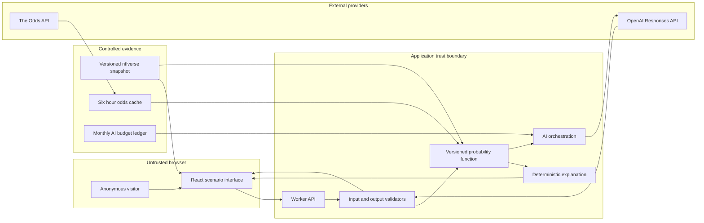
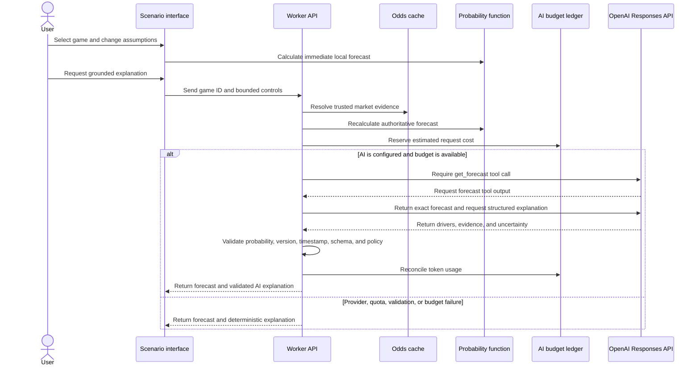

# Frontier AI Architecture

## Recruiter answer

Road to Six demonstrates a production-minded AI pattern: deterministic software calculates the forecast, and runtime AI explains that result under an enforceable contract. The model cannot invent or change the probability. The application also remains useful when the AI provider, market-data provider, or monthly AI budget is unavailable.

This separation is the central technical product decision. It uses AI where language adds value while keeping calculation, evidence, cost, and release risk under product control.

## System view

## Runtime forecast flow

## Deterministic and AI responsibilities

| Concern | Deterministic application | Runtime AI |
|---|---|---|
| Win probability | Calculates football-only and market-aware probabilities with `elo-market-v1.1.0`. | Must reproduce the returned probability unchanged. |
| Market signal | Removes vig within each sportsbook and uses the median sportsbook probability. | Explains the relationship between the model and market evidence. |
| Scenario effects | Applies documented participation adjustments for Cowboys and opponent signals. | Translates those effects into concise, reader-facing language. |
| Evidence | Selects the source snapshot, trusted market record, model version, and timestamp. | Names evidence supplied by the application. |
| Uncertainty | Returns an illustrative bounded range and explicit limitations. | Explains uncertainty and missing context. |
| Responsible use | Blocks client market overrides and prohibits betting actions in the product contract. | Must not recommend a bet, stake, payout, sportsbook, or action. |
| Failure behavior | Always retains a deterministic forecast and explanation. | Is optional and can fail without blocking the core job. |

## Trust boundaries

| Boundary | What crosses it | Control |
|---|---|---|
| Browser to Worker API | Game identifier and bounded scenario-control values | The server ignores client-supplied market prices, normalizes controls from 0 to 100, requires JSON, and limits the request body to 8 KB. |
| Source snapshot to product | Normalized schedule, roster, player, rating, backtest, source, and freshness fields | The snapshot is versioned in source control and rebuilt through a dedicated script from approved source files. |
| The Odds API to application | Current NFL moneyline, spread, and total records | The server keeps the key secret, normalizes Dallas events, removes vig by sportsbook, and caches results for six hours. |
| Application to OpenAI | A bounded scenario prompt and the authoritative forecast tool result | No user profile, wagering history, raw vendor payload, or free-text user content is sent. Requests set `store: false` and use an eight-second timeout. |
| OpenAI to application | Structured explanation fields | The server checks exact probability, model version, source timestamp, required evidence, uncertainty, and prohibited betting language before display. |
| Worker to D1 | Normalized odds cache and aggregate monthly AI usage | No account, identity, scenario history, or wagering data is stored. |

## Reliability and cost controls

1. The core forecast works without either external API.
2. The odds path uses a six-hour in-memory and D1 cache, preserving the 500-credit free allowance under the documented refresh plan.
3. If current odds are absent or unavailable, the server uses the bundled, labeled market snapshot.
4. The AI path reserves cost in D1 before a provider call and reconciles actual token usage after success.
5. The application limit cannot exceed $9.50, leaving a $0.50 margin beneath the separately configured $10 OpenAI project maximum.
6. Input context and output tokens are bounded. The two AI responses are limited to 300 and 500 output tokens.
7. Failed AI calls retain the conservative reservation instead of understating possible spend.
8. Missing credentials, exhausted budget, provider timeout, malformed output, policy failure, or quota failure all return the deterministic explanation.
9. Duplicate client requests are disabled while a market refresh or AI explanation is in progress.
10. CI runs dependency audit, lint, build, and automated tests before release.

## Model and evidence decisions

The baseline is intentionally transparent:

1. Walk-forward Elo creates the football-only probability.
2. A predeclared blend uses 20 percent football probability and 80 percent vig-adjusted market probability when a trusted market is available.
3. Spread, total, and line status remain visible evidence, but they are not counted again in the probability.
4. The 2024 to 2025 holdout contains 544 games. The football-only Brier score is 0.220, the market-aware score is 0.207, and the market baseline is 0.206.
5. The result supports a narrow claim: the market-aware baseline improves on football-only Elo, but it does not outperform the market.

The displayed uncertainty range is an illustrative fixed-width sensitivity band, not a statistically estimated confidence interval. Labeling it this way avoids presenting false precision.

## Product tradeoffs

| Decision | Benefit | Cost or limitation | Why it was selected |
|---|---|---|---|
| AI explains but does not calculate | Prevents a language model from becoming the source of numerical truth. | The AI experience is intentionally narrower. | Trust and auditability are more valuable than open-ended generation for this job. |
| Anonymous exploration | Removes sign-up friction and avoids personal-data collection. | Saved scenarios and user-level controls are deferred. | Authentication did not improve the core portfolio use case. |
| Transparent baseline | Makes assumptions, weights, and backtest results inspectable. | It is not positioned as a production wagering model. | The portfolio is intended to demonstrate judgment, not claim a betting edge. |
| Free data boundary | Keeps the operating model sustainable. | Bettor splits and paid historical odds are excluded. | A $0 sports-data target was an explicit product constraint. |
| Aggregate monthly AI ledger | Enforces cost without collecting identity. | There is no per-user quota or abuse history. | The release remains privacy-minimal while total exposure stays bounded. |
| Deterministic fallback | Preserves the user journey during AI failure. | Generated explanations may not always be available. | Reliability is a product requirement, not a provider assumption. |

## Current limitations

- Runtime AI is securely integrated, but the private release review records an OpenAI `insufficient_quota` blocker. The deterministic fallback is the currently validated hosted behavior.
- The natural-language validator enforces the output contract and a targeted prohibited-advice check, but it does not independently prove every sentence in a generated explanation.
- The application has an aggregate cost ceiling, not identity-based rate limiting.
- The market-aware model is a documented portfolio baseline and does not establish a predictive edge.
- Product KPI targets remain hypotheses because analytics and public-user measurement are not implemented.
- Public hosting still requires Eric Lawler's explicit approval.

## Evidence map

| Claim | Repository evidence |
|---|---|
| Versioned forecast calculation | [`lib/forecast.mjs`](../lib/forecast.mjs) |
| AI tool flow, validation, trusted market resolution, and fallbacks | [`worker/api.ts`](../worker/api.ts) |
| Cost estimation and request reservation | [`lib/ai-budget.mjs`](../lib/ai-budget.mjs) |
| D1 budget and odds-cache schemas | [`db/schema.ts`](../db/schema.ts) |
| Versioned data snapshot and holdout results | [`app/data/nfl-snapshot.json`](../app/data/nfl-snapshot.json) |
| Forecast and scenario interface | [`app/page.tsx`](../app/page.tsx) |
| Product decisions and rationale | [`decision-log.md`](decision-log.md) |
| Release gates and validated limitations | [`release-review.md`](release-review.md) |
| Automated forecast, cost, cache, and rendering checks | [`tests`](../tests) |
