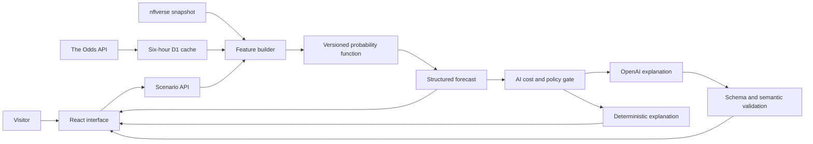

# Portfolio Case Study: Road to Six

## Executive summary

Road to Six is an unofficial Dallas Cowboys forecasting and market-context lab that demonstrates end-to-end technical product management for an evidence-grounded AI product. Market bias remains an unvalidated hypothesis because the approved scope excludes bettor-split data.

I designed the product around one question:

> Can a visitor inspect football and market evidence, change assumptions, and understand a traceable probability and its uncertainty in under five minutes without receiving betting advice?

I owned the product strategy, prioritization, data and AI boundaries, acceptance criteria, release governance, and go-live decision. I used Codex as an implementation and review partner. That operating model let me move quickly while preserving explicit human ownership of requirements, risk decisions, and publication approval.

The result is a public v1.0.0 product and GitHub release with real football data, current odds integration, a transparent probability baseline, a structured Runtime AI pathway, deterministic fallback, automated quality gates, production smoke evidence, and a complete product artifact set. Sites version 13 contains the exact tagged release commit and passed both the owner-authenticated review and signed-out production smoke test. Sites version 14 then deployed the reviewed metadata and CSP hardening commit and passed a fresh signed-out smoke test.

## Product context

### Problem

Many sports forecasts hide the path between evidence and prediction. A user sees a percentage but cannot answer basic questions:

1. What data produced this result?
2. How current is the evidence?
3. Which assumptions materially changed the outcome?
4. How does the model compare with the betting market?
5. What uncertainty or missing data should limit confidence?
6. Did an AI calculate the number or merely explain it?

This is a trust and product-design problem. A more sophisticated model would not fix it on its own.

### Target users

**Primary user:** A hiring manager or technical product leader evaluating product judgment, systems thinking, delivery discipline, and responsible AI design.

**Secondary user:** A football fan who wants to explore how named assumptions affect a Cowboys forecast.

### Job to be done

When I question a Cowboys forecast or market narrative, help me inspect the football evidence, market context, assumptions, probability, and uncertainty so I can understand the result without receiving betting advice.

## My role and ownership

I served as the technical product manager and decision owner.

| Product responsibility | What I owned |
|---|---|
| Vision and strategy | Problem framing, target users, product principles, scope, non-goals, and success measures |
| Discovery and prioritization | Assumption identification, data spike, BETS prioritization, staged MVP decisions, and backlog |
| Technical product design | Data contracts, API behavior, source freshness, forecast contract, AI tool boundary, cache, and fallback |
| Vendor and cost management | $0 sports-data target, free-tier odds plan, $10 OpenAI project limit, and $9.50 application cutoff |
| Risk and governance | Accessibility, security, privacy, responsible use, data rights, trademark, and release review |
| Delivery management | Acceptance criteria, Codex task direction, specialist reviews, test gates, documentation, and private deployment approval |
| Release ownership | Used an owner-only preview and blocked public hosting until explicit final approval, validated the live Runtime AI baseline, and completed final regression as a separate gate |

I did not represent Codex-generated implementation as unsupervised product work. I established repository rules, reviewed outputs, challenged assumptions, requested corrections, and accepted or rejected release gates.

## Product strategy

### Product principles

1. **Evidence before prediction:** A forecast must show its source, timestamp, and model version.
2. **Assumptions are controls:** Users can change named inputs and see the resulting probability change.
3. **Deterministic code owns calculation:** A versioned function, not an LLM, produces the probability.
4. **AI explains, people decide:** AI explains evidence and uncertainty without recommending a bet.
5. **Reliability is a product feature:** The core workflow remains available when AI, live data, or budget capacity is unavailable.
6. **Governance is part of delivery:** Accessibility, privacy, security, data rights, and trademark checks are release criteria.

### Success model

The measurement plan separates portfolio hypotheses from verified engineering and model evidence.

| Layer | Measure | MVP target |
|---|---|---:|
| Vision | Forecast completion after changing an assumption | 60% |
| Adoption | Scenario start | 70% |
| User value | Time to structured forecast | Under 5 minutes |
| Platform | Probability function fidelity | 100% |
| Integrity | Evidence and freshness traceability | 100% |
| Responsible use | No prohibited betting guidance | 100% |
| Cost | Sports-data vendor spend | $0 monthly |
| Cost | Runtime AI spend | No more than $10 monthly |

These product adoption targets remain hypotheses because analytics are intentionally deferred. Model, quality, security, and release results are reported separately as verified outcomes.

## Scope decisions

### Included

- Versioned 2026 Dallas roster and schedule data
- Complete 2025 regular-season player production baselines
- Four matchup-aware opponent production leaders
- Current moneyline, spread, total, and line-status context
- Football-only, market-implied, and market-aware probabilities
- Named scenarios for Dallas and the selected opponent's top producer
- Walk-forward model audit and visible Brier scores
- Structured Runtime AI explanation of drivers, evidence, and uncertainty
- Runtime reliability receipt with model, prompt, contract, evaluation, latency, token, cost, validation, source, and fallback evidence
- Deterministic explanation when AI is unavailable
- Source, freshness, model-version, and responsible-use labels
- Public product, architecture, backlog, measurement, decision, and release artifacts

### Excluded

- Picks, stake sizing, payout claims, sportsbook links, or wager placement
- Bettor ticket or money percentages
- Player medical, contract, private, or nonpublic data
- Paid sports feeds or paid historical odds
- Accounts, saved scenarios, and personal-data persistence
- Official logos, headshots, uniforms, or endorsement claims

## Key decisions and tradeoffs

### 1. Transparent baseline before model complexity

I selected walk-forward Elo as the football baseline and predeclared a 20% football to 80% vig-adjusted market blend. The 2019 to 2023 window informed development, and the 2024 to 2025 window remained the holdout.

**Why:** The approach is reproducible, understandable, and resistant to hindsight storytelling.

**Tradeoff:** A transparent baseline may be less predictive than a complex model, but it makes leakage, assumptions, and limitations easier to audit.

### 2. Per-book vig removal before consensus

The model removes vig within each sportsbook before taking the median Dallas probability.

**Why:** Combining raw moneylines first could produce a distorted market probability.

**Tradeoff:** This requires additional normalization logic, but it protects forecast integrity.

### 3. AI explains but does not invent the probability

The Runtime AI contract requires the versioned probability result, model version, source time, evidence, uncertainty, and educational notice. Semantic validation rejects a changed probability, unsupported evidence, or actionable betting language.

**Why:** AI is valuable for synthesis but should not become an untestable source of truth.

**Tradeoff:** More outputs fail closed, but every accepted explanation preserves the product contract.

### 4. Availability over AI dependency

The deterministic explanation is a first-class product state.

**Why:** A quota issue, timeout, budget cutoff, or invalid AI response should not block the user's core job.

**Tradeoff:** The fallback is less conversational, but reliability and cost predictability improve.

### 5. Anonymous exploration over authentication

Accounts and saved scenarios remain out of scope.

**Why:** Authentication does not improve the core showcase job and would add privacy, security, and maintenance scope.

**Tradeoff:** The product cannot personalize or persist scenarios.

### 6. Free data with a bounded market-context claim

The product uses nflverse and The Odds API free tier. Bettor splits were rejected.

**Why:** The $0 boundary keeps the portfolio sustainable and avoids inferring Cowboys popularity without licensed evidence.

**Tradeoff:** The product can compare football and market probabilities, but it cannot claim bettor sentiment explains the difference.

## Experience design

The flow turns model transparency into a usable product experience:

1. The visitor selects a Cowboys game.
2. The interface updates Dallas controls and the opponent's four most impactful rostered producers.
3. The visitor reviews football and market sources and timestamps.
4. The visitor changes participation assumptions.
5. The versioned function calculates football-only and market-aware probabilities.
6. The interface compares those results with the vig-adjusted market probability.
7. The product shows named drivers, evidence, uncertainty, model version, and responsible-use language.
8. Runtime AI may explain the result if quota, budget, and validation gates pass.
9. The deterministic explanation preserves the result when AI is unavailable.

The editable [Figma user flow](https://www.figma.com/board/m4Jj2PH2pCWMjcyUFNibyS?utm_source=other&utm_content=edit_in_figjam&oai_id=v1%2FxUmyGVk5KOQTJRulUQKNwQe3yEmxEnoOxDP8Doq1z3TYSWL0h07UaA&request_id=ee641610-369e-4632-a92c-ff043a56fac1) preserves both the original readiness concept and the evolved Market Context Lab. A static Mermaid representation is checked into [Figma Flow](figma-flow.md) so the experience remains reviewable without external access.

## Technical architecture

### Trust boundaries

- Vendor and OpenAI credentials remain server-side.
- Client-supplied market prices are ignored.
- Odds responses are normalized and cached, not exposed as a standalone feed.
- Request payloads, prompts, output tokens, and timeouts are bounded.
- The AI receives a bounded scenario and cited evidence, not personal data or raw vendor payloads.
- Aggregate monthly AI spend is the only persisted application record.
- Public exploration collects no profile, wagering history, or personal information.

See the full [architecture](architecture.md) for components and data flow.

## Frontier AI system design

### Why use AI

Forecast evidence can be technically accurate but difficult to interpret. Runtime AI can make a structured result more accessible by explaining:

- What moved the probability
- Which evidence supports each driver
- How the model and market differ
- What uncertainty or missing evidence should limit confidence

### Why not let AI calculate

A free-form LLM probability would be hard to reproduce, evaluate, version, and audit. The product therefore assigns calculation to deterministic software and explanation to AI.

### Evaluation contract

An accepted AI response must:

1. Match the deterministic probability.
2. Match the model version.
3. Match the source timestamp.
4. Cite supplied evidence.
5. Include material uncertainty.
6. Avoid picks, stakes, payouts, sportsbook links, and other actionable betting guidance.
7. Fall back safely when any check fails.

### Cost and reliability

The system uses a dedicated OpenAI project with a $10 monthly maximum. The application reserves estimated cost before a request, reconciles actual token use, stops AI calls at $9.50, and serves the deterministic explanation afterward.

After billing was enabled, one live OpenAI response completed in AI mode with no fallback. It preserved probability `0.5531549573107291`, forecast model `elo-market-v1.1.0`, source date `2026-07-15`, three drivers, and three uncertainty items. The same seven-criterion evaluator passed all seven checks. The later four-scenario scorecard and 76-test regression also pass. The public deployment then passed signed-out current-odds and Runtime AI smoke checks.

## Data and model integrity

### Data lineage

Every normalized record includes a source, source identifier, season and week, source update time, ingestion time, license label, snapshot version or checksum, and validation status.

### Model evidence

| Model | Holdout Brier score | Interpretation |
|---|---:|---|
| Football-only Elo | 0.220 | Transparent football baseline |
| Market-aware blend | 0.207 | Improved on football-only Elo |
| Market baseline | 0.206 | Remained marginally stronger than the blend |

The result supports a disciplined conclusion: market context improved the football baseline, but this prototype did not beat the market. The product makes that limitation visible and does not claim predictive advantage.

## Delivery and governance

### How Codex was used

I used Codex for implementation, testing, code review, documentation, browser validation, and deployment preparation. I constrained that work through:

- Repository-level product and engineering rules
- Narrow, testable tasks
- Explicit file ownership during parallel work
- Automated build, lint, test, and dependency gates
- Specialist technical, release, and UX reviews
- Human approval before credentials, public access, or publication

This is the same product-management pattern I would use with an engineering team: clarify outcomes, define boundaries, create observable acceptance criteria, review evidence, and retain release accountability.

### Release gates

| Gate | Status |
|---|---|
| Product flow | COMPLETE |
| Automated and expert accessibility review | COMPLETE with an explicit no-human-testing boundary |
| AI persona portfolio validation | COMPLETE; transparent synthetic evidence, not human research |
| Live odds | COMPLETE |
| Security and privacy | COMPLETE |
| Responsible use | COMPLETE |
| Data rights | ACCEPTED WITH LIMITATIONS |
| Trademark and public content | ACCEPTED WITH LIMITATIONS |
| Runtime AI live response | COMPLETE for the live baseline |
| v1.0.0 hardening regression | COMPLETE |
| Public hosting | COMPLETE |

## Verified outcomes

1. The production build and lint checks pass.
2. All 76 automated tests pass.
3. The current dependency audit reports zero vulnerabilities.
4. The authenticated release candidate returned five current Dallas events from The Odds API during its pre-publication review. The signed-out production endpoint later returned 17 current NFL events and the interface matched 11 Cowboys games.
5. Successful six-hour cache persistence models 372 credits in a 31-day month, below the free allowance. Upstream and persistence failures remain monitored separately.
6. Market probability is calculated after removing vig within each sportsbook.
7. The 2024 to 2025 holdout reports all three Brier scores in the interface.
8. The Runtime AI suite passes 12 of 12 expected outcomes across seven criteria and 84 binary checks, including exact evidence, exact uncertainty, and prohibited-advice cases.
9. A four-scenario live scorecard passed four of four Runtime AI and four of four deterministic cases. Runtime AI averaged 3,568 ms and an estimated $0.013118 total with no fallbacks in this bounded sample.
10. The product remains usable through bundled odds and deterministic explanation when an external dependency fails.
11. Desktop and mobile accessibility and overflow checks pass the documented portfolio review.

## What I learned

1. **Trust is an experience, not a disclaimer.** Source, freshness, assumptions, uncertainty, and limitations must appear in the workflow.
2. **The best AI boundary is often narrower than the first idea.** AI added value as an interpreter, while deterministic code remained the calculation authority.
3. **A fallback can be a product capability.** Treating deterministic output as a normal state improved reliability and made cost limits credible.
4. **Vendor constraints shape product design.** Caching, source selection, and scope decisions made the $0 data target achievable.
5. **A negative model conclusion is still a successful product outcome.** Reporting that the prototype did not beat the market demonstrates integrity.
6. **Frontier AI accelerates delivery only when product ownership stays explicit.** Clear constraints, tests, and approvals converted speed into reliable evidence.

## Current limitations and next decisions

1. Product adoption targets remain unmeasured because analytics are not implemented.
2. The portfolio evidence gate is complete through owner-reviewed AI proxy pretests and transparent synthetic persona simulations. No human usability testing has been conducted or claimed. Optional future moderated research could add observed behavioral evidence.
3. The forecast is a transparent portfolio baseline, not a production wagering model.
4. Historical odds and bettor splits remain outside the free-data scope.
5. Public hosting and the signed-out success-path smoke test were completed on July 30, 2026.
6. Data and trademark limitations remain accepted risks, not legal clearance.

## Artifact index

- [Recruiter overview](../README.md)
- [Product brief](product-brief.md)
- [Architecture](architecture.md)
- [Frontier AI architecture](frontier-ai-architecture.md)
- [Runtime AI evaluation](ai-evaluation.md)
- [Live AI scorecard](live-ai-scorecard.md)
- [Synthetic ideal-persona simulations](synthetic-persona-sessions.md)
- [Codex collaboration](codex-collaboration.md)
- [MVP backlog](mvp-backlog.md)
- [Measurement plan](measurement-plan.md)
- [Decision log](decision-log.md)
- [Data and licensing spike](data-licensing-spike.md)
- [Public-use review](public-use-review.md)
- [Release review](release-review.md)
- [Dependabot review](dependabot-review-2026-07-30.md)
- [Figma flow](figma-flow.md)
- [LinkedIn launch kit](linkedin-launch-kit.md)
- [Usability research](usability-research.md)
- [Moderated usability session kit](usability-session-kit.md)
- [Repository launch checklist](repository-launch-checklist.md)
- [Third Party Data and Rights Notice](../NOTICE.md)
- [Security policy](../SECURITY.md)
